  
  

  
   
  

**AI Engineer** with 2 years shipping production GenAI at **KPMG** (Sep 2024 – present) — multi-agent pipelines, RAG over large document corpora, vector search at scale, and LoRA/QLoRA fine-tuning. I build eval-first: every system ships with numbers, not vibes. And I open-source something new every single day. 📍 Bengaluru, India 🏴‍☠️ 

> *"If you don't take risks, you can't create a future." — Monkey D. Luffy*

---

### 🛠️ Stack · 技術

---

### 🚀 What I'm building · 冒険

  

*Every repo ships a real commit every day — and every README leads with eval numbers.*

---

### 📊 Stats · 戦績

<em>🏴‍☠️ Bounty rising — one commit at a time.</em> 

---

### 🐍 Contributions

  <a href="https://github.com/tushar29k">
    <picture>
      <source media="(prefers-color-scheme: dark)" srcset="https://raw.githubusercontent.com/tushar29k/tushar29k/output/github-snake-dark.svg" />
      
    </picture>
  </a>

---

  

### 📫 Get in touch

  
   
  <em> Puru puru puru… the line is open 📞🐌</em>

- **Email:** maxtushar292001@gmail.com
- **Open to:** AI Engineer / GenAI Engineer / LLM Engineer roles — anywhere in India, remote-friendly

  

